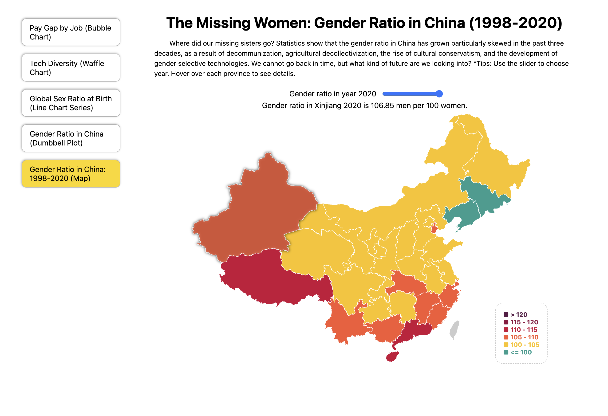
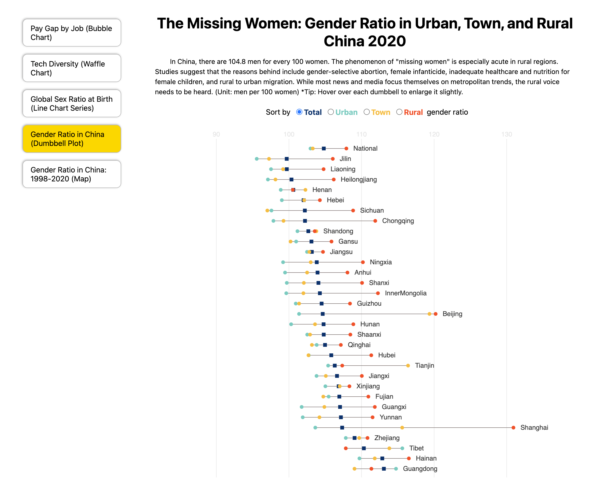
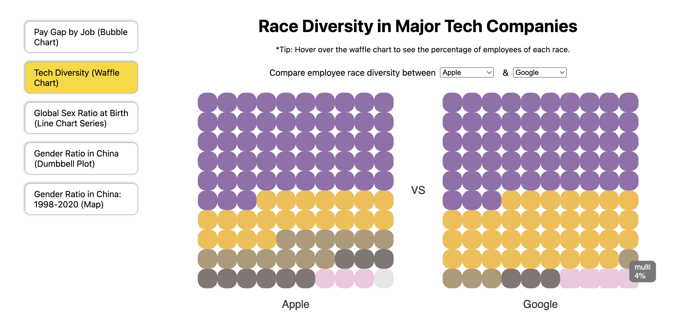

# 📊 Gender Inequality Data Visualization Project


> **Raising awareness about gender inequality through interactive data visualizations**

## 🎯 Project Overview

This project is an interactive data visualization dashboard that explores various aspects of **gender inequality** across different domains - from workplace pay gaps to demographic disparities. Built as part of my first-year Computer Science coursework (CM1010 - Introduction to Programming II), this project aims to make gender inequality data accessible and impactful through compelling visual storytelling. Additionally, it includes an analysis of racial diversity in the tech industry to provide broader context on inequality issues.

## 🌟 Key Message

**Gender inequality remains a persistent global challenge.** Through data visualization, we can:

- Make complex statistics more understandable
- Reveal patterns that might otherwise go unnoticed
- Spark conversations about systemic inequalities
- Drive awareness that leads to positive change

_Note: This project primarily focuses on gender inequality, with one additional visualization exploring racial diversity in tech to provide broader context on workplace inequality._

## 📈 Visualizations Included

1. **🗺️ Gender Ratio in China by Provinces: 1998-2020 (Map)** - Geographic visualization showing gender ratio distribution across Chinese provinces over time



2. **🌆 Gender Ratio in Urban, Town, and Rural China 2020 (Dumbbell Plot)** - Comparison of gender ratios between different settlement types in China



3. **👶 Sex Ratio At Birth in Top 10 Most Populated Countries (Line Chart Series)** - Time-series analysis of birth gender ratios in major world populations


4. **💰 Gender Pay Gap by Occupations, UK (Bubble Chart)** - Interactive visualization showing wage disparities across different professions


5. **🏢 Race Diversity in Top Tech Companies (Waffle Chart)** - Analysis of racial representation in major technology corporations



## 💻 Technical Skills Demonstrated

### **Programming Languages & Technologies**

- **JavaScript** - Core programming logic and data manipulation
- **HTML5** - Semantic markup and web structure
- **CSS3** - Styling and responsive design
- **p5.js** - Creative coding library for interactive graphics

### **Data Visualization Techniques**

- **Geographic Maps** - For spatial data representation showing regional patterns
- **Dumbbell Charts** - For comparison visualizations between categories
- **Line Chart Series** - For time-series analysis across multiple datasets
- **Bubble Charts** - For multi-dimensional data representation
- **Waffle Charts** - For proportional data display
- **Interactive Elements** - Hover effects, click interactions, and dynamic updates

### **Software Engineering Practices**

- **Modular Code Architecture** - Organized code into reusable components
- **Object-Oriented Programming** - Used classes and objects for visualization management
- **Data Processing** - CSV parsing and data transformation
- **Gallery Pattern** - Implemented navigation between multiple visualizations
- **Version Control** - Project managed with Git

### **Data Analysis Skills**

- **CSV Data Processing** - Handling real-world datasets
- **Statistical Visualization** - Representing complex statistics clearly
- **Cross-Domain Analysis** - Analyzing data from multiple sources and time periods
- **Data Storytelling** - Crafting narratives through visual representation

## 📁 Project Structure

```
├── index.html              # Main application entry point
├── css/
│   └── style.css           # Styling and layout
├── js/
│   ├── sketch.js           # Main p5.js setup and gallery management
│   ├── pay-gap.js          # Gender pay gap visualization
│   ├── tech-diversity.js   # Tech industry diversity analysis
│   ├── sex-ratio-at-birth.js # Global birth ratio visualization
│   ├── gender-ratio.js     # China gender ratio analysis
│   ├── gender-ratio-by-year.js # Time-series gender ratio trends
│   └── helper-js/          # Reusable visualization components
│       ├── gallery.js      # Navigation system
│       ├── bubble.js       # Bubble chart implementation
│       ├── line.js         # Line chart functionality
│       ├── waffle.js       # Waffle chart component
│       └── dumbbell.js     # Dumbbell chart visualization
├── data/                   # Real-world datasets
└── lib/
    └── p5.min.js          # p5.js library
```

## 🛠️ How to Run

1. Open the project folder in VS Code
2. Install the "Live Server" extension if you haven't already
3. Right-click on index.html and select "Open with Live Server"
4. The webpage will open in your browser automatically

## 📚 Learning Outcomes

Through this project, I developed skills in:

- **Creative Coding** with p5.js for interactive graphics
- **Data Visualization Design** principles and best practices
- **JavaScript Programming** including ES6+ features
- **Web Development** fundamentals (HTML, CSS, JavaScript)
- **Problem-Solving** through iterative design and debugging
- **Social Impact Technology** - using code to address real-world issues

## 🌍 Impact & Reflection

This project reinforced my belief that **technology can be a powerful tool for social change**. By making inequality data more accessible and engaging, we can:

- Educate viewers about persistent inequalities (both gender and racial)
- Encourage data-driven discussions about systemic issues
- Inspire action toward creating more equitable societies

Data tells stories, and these stories matter. Every visualization in this project represents real people and real challenges that deserve our attention and action.

---

## 🤝 Connect With Me

**Let's discuss gender equality, data visualization, or technology for social good!**

[](https://www.linkedin.com/in/yuewuxd/)

---

_Built with ❤️ and a commitment to equality | University of London - Computer Science_
